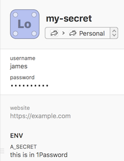

# 1password-env

Store Environment Variables in your 1Password secrets and retrieve them on-demand for use in temporary shells. Good for using AWS credentials from your terminal without having to store them on disk.

## Installation

```sh
brew tap jagregory/tools
brew install 1password-env
```

## Setting up your secrets

Before you can use `op-env` you need to set up your secrets. In your 1Password vault, create or edit a secret and add a new section called "env". Any fields you add in this "env" section will be exported as Environment Variables in your Terminal when you use `op-env`.



## Usage

`op-env` takes one argument: the name of a 1Password secret.

```sh
$ op-env my-secret
```

When you run `op-env` it will try to read the secret from your 1Password vault. If you haven't used `op-env` before (or for a while) you will need to supply your Vault credentials. `op-env` will re-use your 1Password session for as long as it can, but eventually it will be locked out and you'll need to re-authenticate.

After unlocking your vault and locating the secret, `op-env` will launch a new sub-shell (using your `$SHELL`) which has the variables from your secret exported. The variables are not available anywhere outside of this sub-shell.

```
🔒 Temporary shell for my-secret 🔒

~/dev $ echo $A_SECRET
this is in 1Password
```
